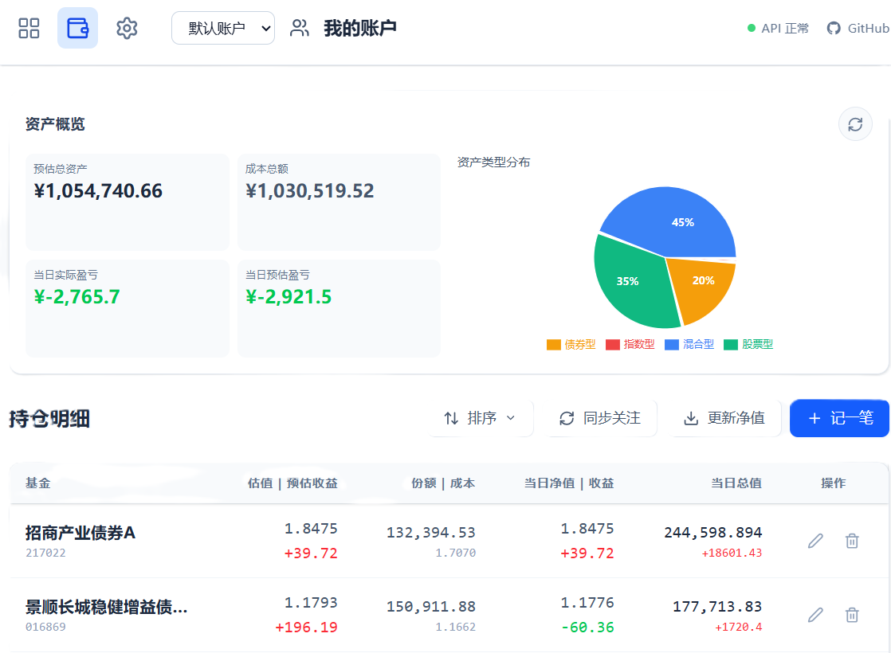
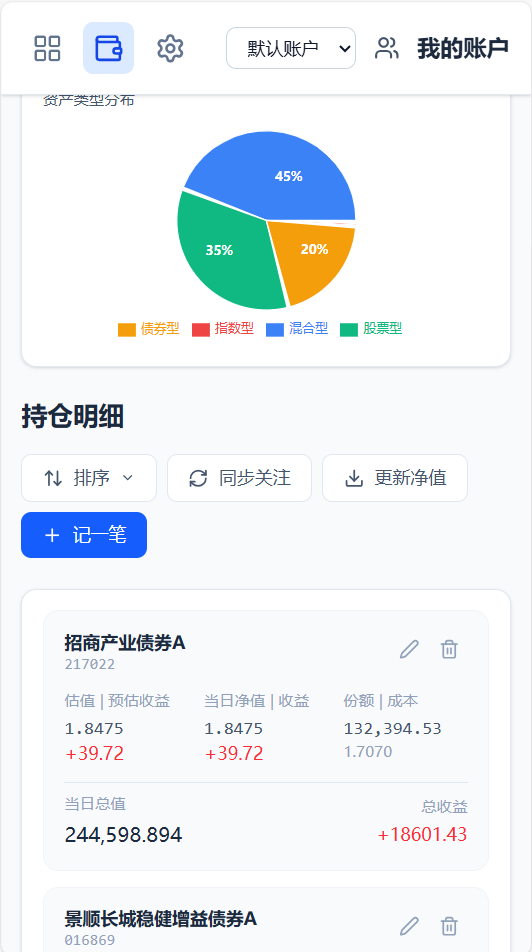
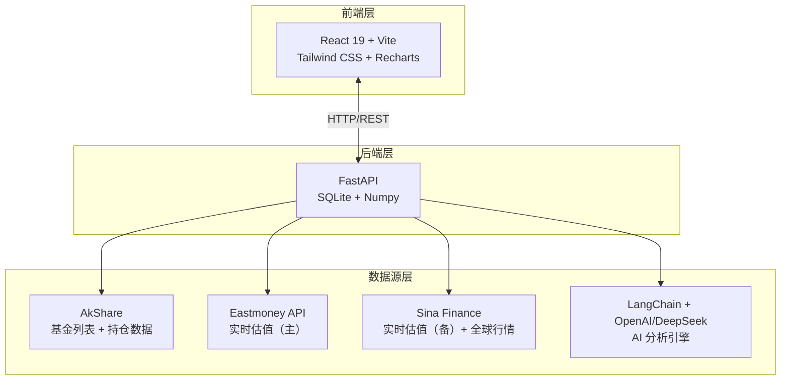

# FundVal Live
项目基于Ye-Yu-Mo/FundVal-Live，感谢原项目作者的贡献。


**盘中基金实时估值与逻辑审计系统**


---

## 目录

- [预览](#预览)
- [快速开始](#快速开始)
  - [方式一：桌面应用（推荐）](#方式一桌面应用推荐)
  - [方式二：Docker 部署（推荐服务器部署）](#方式二docker-部署推荐服务器部署)
  - [方式三：命令行运行](#方式三命令行运行)
- [核心功能](#核心功能)
- [技术架构](#技术架构)

---

## 预览

### 持仓页面增加了 当日净值和收益的数据，能看到当日的预估值和实际的净值、收益


### 修改了手机端的持仓页面，使页面更紧凑



## 快速开始

### 方式一：桌面应用（推荐 

**下载安装包，双击即用，无需配置环境**

#### 下载

前往 [Releases](https://github.com/ashurm001/FundVal-Live/releases/latest) 下载最新版本：


#### 安装


### Docker 部署（推荐服务器部署）

**一键部署，无需配置环境，适合服务器或 NAS**

#### 1. 安装 Docker

- **Linux**: `curl -fsSL https://get.docker.com | sh`
- **macOS/Windows**: 下载 [Docker Desktop](https://www.docker.com/products/docker-desktop)

#### 2. 启动服务

**快速体验（最简启动）**

```bash
# 拉取镜像
docker pull ghcr.io/ashurm001/fundval-live:latest

# 启动服务（无 AI 分析）
docker run -d -p 21345:21345 ghcr.io/ashurm001/fundval-live:latest

# 访问 http://localhost:21345
```

**完整配置（推荐生产环境）**

```bash
# 带数据持久化 + AI 分析
docker run -d \
  --name fundval-live \
  -p 21345:21345 \
  -v fundval-data:/app/backend/data \
  -e OPENAI_API_KEY=your_api_key \
  -e OPENAI_API_BASE=https://api.openai.com/v1 \
  ghcr.io/ashurm001/fundval-live:latest

# 或使用 docker-compose
wget https://raw.githubusercontent.com/ashurm001/FundVal-Live/main/docker-compose.yml
docker-compose up -d
```

**本地构建（开发者）**

```bash
# 克隆项目
git clone https://github.com/ashurm001/FundVal-Live.git
cd FundVal-Live

# （可选）配置环境变量
cp .env.docker .env
# 编辑 .env 填入 API Key 等配置

# 启动服务（自动构建）
docker-compose up -d

# 查看日志
docker-compose logs -f
```

#### 3. 访问

打开浏览器访问 `http://localhost:21345`

#### 4. 管理

```bash
# 停止服务
docker-compose down

# 更新到最新版本
docker-compose pull
docker-compose up -d

# 查看状态
docker-compose ps

# 查看日志
docker-compose logs -f
```

#### 数据持久化

数据存储在 Docker volume `fundval-data` 中，即使删除容器也不会丢失。

---

### 方式三：命令行运行

**适合开发者和需要自定义配置的用户**

#### 环境要求
- Python 3.13+
- Node.js 18+
- uv (Python 包管理工具)

#### 1. 配置 AI 分析（可选）

在项目根目录创建 `.env` 文件：

```ini
# OpenAI / DeepSeek API 配置
OPENAI_API_KEY=sk-xxxxxxxx
OPENAI_API_BASE=https://api.openai.com/v1
AI_MODEL_NAME=deepseek-chat
```

#### 2. 一键启动

```bash
# 自动安装依赖 + 后台运行 + 日志记录
./start.sh

# 查看运行日志
tail -f logs/backend.log

# 停止服务
./stop.sh
```

#### 3. 访问

打开浏览器访问 `http://localhost:21345`

---

## 核心功能

### 全球市场盘中估值
- 支持 **A 股 / 港股 / 美股** 实时行情
- 自动识别 QDII 基金持仓代码格式
- 多源容灾（天天基金 ⇄ 新浪财经）

### 硬核技术指标
基于 250 个交易日净值序列，Numpy 向量化计算：
- **夏普比率** — 风险调整后收益效率
- **最大回撤** — 历史极端风险审计
- **年化波动率** — 持仓稳定性量化

### Linus 风格 AI 审计
不复述新闻舆情，只基于数学事实：
- 估值偏差分析
- 技术位阶判断
- 回撤特征审计
- 直接输出 **持有 / 止盈 / 定投** 指令

### 持仓管理
- 记录成本和份额
- **加仓 / 减仓**：按 15:00 规则（当日/下一交易日净值）T+1 确认后更新持仓成本与份额；支持操作记录回溯
- 实时计算持有收益
- 组合可视化（饼图）
- 一键同步到关注列表

### 订阅提醒
- 波动提醒（涨跌幅超阈值）
- 每日摘要（指定时间发送）
- 邮件通知（SMTP）

---

## 技术架构



**技术栈**：
- **前端**：React 19 + Vite + Tailwind CSS + Recharts + Lucide Icons
- **后端**：FastAPI + SQLite + Numpy + AkShare
- **AI**：LangChain + OpenAI/DeepSeek

---

## 核心理念

### 拒绝黑箱
估值基于透明的持仓权重与实时行情加权计算，不依赖单一滞后的第三方接口。

### 数据审计
自动清洗持仓数据，剔除重复项与零权重噪音，确保分析基座的纯净。

### 多源容灾
自动在天天基金、新浪财经等多个数据源间无缝切换，确保 QDII 及新成立基金的估值可用性。

### 数学归因
用夏普比率、最大回撤、年化波动率等硬指标替代主观的评分体系。

---

## 开源协议

本项目采用 **GNU Affero General Public License v3.0 (AGPL-3.0)** 开源协议。

**这意味着**：
- 你可以自由使用、修改、分发本软件
- 个人使用无需开源你的修改
- 如果你用本项目代码提供网络服务（SaaS），必须开源你的修改
- 衍生作品必须使用相同协议

**为什么选择 AGPL-3.0？**
- 金融工具需要透明度，用户有权知道估值逻辑
- 防止闭源商业化，确保改进回流社区
- 保护开源生态，避免"拿来主义"

详见 [LICENSE](LICENSE) 文件。

---

## 免责声明

本项目提供的数据与分析仅供技术研究使用，不构成任何投资建议。市场有风险，代码无绝对，交易需谨慎。

---

## Star History

[](https://www.star-history.com/#ashurm001/FundVal-Live&type=date&legend=top-left)
